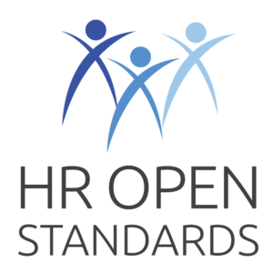
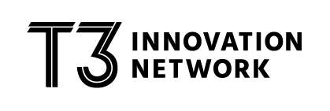
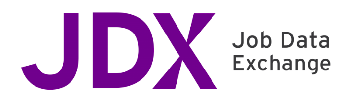
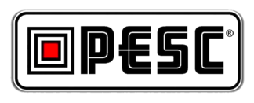

If there's one lesson I've learnt over many years in the technology sector, it's
that the problems you're solving today have definitely been solved by someone
else already. Generally by someone smarter than you who also happens to have
more background knowledge than you :)

The challenge lies in finding those solutions.

This is absolutely true for the skills domain that I've decided to tackle as
part of DevSkillDojo. It should come as no real surprise that the skills concept
exists at the intersection of a number of different business domains. These
include:

* Job Specifications
* Learning and Skills Development
* Recruitment Services
* Performance Management
* Freelance Contract Marketplaces
* And possibly some others that I'm yet to become aware of

Each of these domains has a primary purpose, but in some way, they are
interested in a person's skills.

Since I have a stated goal of defining an ontology for technical skills (https://devskilldojo.com/blog/defining-the-devskilldojo-purpose/), 
I will be well served by exploring each
of these different domains to see what standards and practices already exist in
each. Over the last few weeks, I've done exactly that and thought it would be
useful to share some of the resources I've found here:

### Schema.org types
 

 

Looking at the standardised datatypes at Schema.org is a great place to begin a
search of this kind. Of particular interest are the following types:

* JobPosting (https://schema.org/JobPosting)
* Course (https://schema.org/Course)
* Occupation (https://schema.org/Occupation)
* Organization (https://schema.org/Organization)
* Person (https://schema.org/Person)
* Skills (https://schema.org/skills)
* EducationalOccupationalCredential (https://schema.org/EducationalOccupationalCredential)

If we dig a little deeper, we notice that the "skill" property under JobPosting
has the type "Defined Term", which means that it becomes an implementation
detail. However, the Talent-Signal community (more about them later) are
actively working towards building more structure here.

### O*Net Center
 

 

The O*Net Center provides a number of resources that are very valuable from a
skills perspective. These include:

* The O*Net Database (https://www.onetcenter.org/database.html), which contains a rich set of variables that describe work and worker characteristics, including skills requirements.
* The O*Net Content model (https://www.onetcenter.org/content.html), which provides a framework for the most important types of information about work and integrates them into a cohesive system.
* The O*Net Standard Occupational Classification taxonomy (https://www.onetcenter.org/taxonomy.html), which provides a standardised classification solution for occupations.

Due to the expansive nature of the O*Net resources, the skills details that
would be valuable to DevSkillDojo tends to fall through the cracks. 

However, as our ontology develops, we will relook at O*Net to compare notes.

### International Standard Classification of Occupations (ISCO)
 

 

The ISCO plays a similar role to O*Net, and provides two resources that are
quite valuable (at a high level):

* A classification structure for occupation categories.
* A definition for each of the identified occupation categories. These definitions provide tasks and example occupations in each category.

The resources can be found at: https://www.ilo.org/public/english/bureau/stat/isco/isco08/

It is important to realise that ISCO identifies occupation categories, not
individual occupations. This means our Ontology should reference it as a source
of reference data in one or more lookup fields.

### HR Open
 

 

HR Open (or the HR Open Standards Consortium) is an independent, non-profit
organisation that develops and publishes a set of XML and JSON specifications
for human resource related data. The specifications at HR Open are extremely
comprehensive and valuable. You can download them from https://hropenstandards.org/

Key packages/namespaces that are of interest to DevSkillDojo are:

* common/person
* common/profile
* common/competency
* assessments
* recruiting
* screening

### W3C Talent-signal
 

 

The W3C Talent Marketplace Signalling Community Group (https://www.w3.org/community/talent-signal/) is a working group who are
assisting the schema definitions at Schema.org.
They serve as a useful hub for various initiatives around skills and talent.
I've recently joined the work group and I'm keen to participate in the process.

### T3 Innovation Network
 

 

The T3 Innovation network is a hugely exciting initiative that takes dead-aim at
solving the problem of data standards and interoperability in the talent
marketplace. To quote from their web page: The T3 Network will:

* Define what a competency-based lifelong learner record should be so that all learning counts, no matter where it takes place.
* Modernise technology and advance data standards to achieve seamless sharing of data throughout a person’s education and career pathway.
* Empower individuals with a validated record of their skills and competencies in a way that all employers can understand.

You can find additional data about the T3 Innovation Network at: https://www.uschamberfoundation.org/t3-innovation

### JDX (Job Data Exchange)
 

 

Related to the T3 Innovation network is the JDX (Job Data Exchange). The Job
Data Exchange is an initiative that aims to “improve how clearly employers
communicate their hiring needs to workforce development partners and educators
across the country”. JDX has a data model based on schema.org and HR Open
Standards.

You can find additional data about the JDX at: 
https://www.uschamberfoundation.org/workforce-development/JDX

### ESCO

ESCO (European Skills, Competences, Qualifications and Occupations) “works as a
dictionary, describing, identifying and classifying professional occupations,
skills, and qualifications relevant for the EU labour market and education and
training”. In addition to describing 3000 occupations and 13000 skills, it also
includes an API for accessing the information.

You can find additional data about ESCO at: https://ec.europa.eu/esco/portal/home

### EuroPass

Europass is a centralised structure and repository of resume (and related)
information that allows job applicants to share their relevant information as
part of the job searching process. Although it is likely that EuroPass uses a
standardised data structure, their goal is not to standardise data structures,
but rather the data presentation.

For more information about Europass, please refer to: https://europass.cedefop.europa.eu

### JSON Resume
 

 

In contrast with the large initiatives identified so far, the JSON Resume
project is a bottom-up initiative by software developers to define a JSON
structure for effectively storing Resume data in JSON format. Additionally, it
includes the capability to transform this format into a multitude of
configurable templates.

For additional information about JSON Resume, have a look at https://github.com/jsonresume

### PESC
 

 

The PESC (Post-Secondary Electronic Standards Council) is a grouping of
standardisation organisations from multiple countries who work together to
achieve successful data exchange w.r.t Post-secondary education. For additional
details about the PESC, please refer to https://www.pesc.org/

### Credential Engine
 

 

The Credential Engine is a non-profit whose mission is to “create credential
transparency, reveal the credential marketplace, increase credential literacy,
and empower everyone to make more informed decisions about credentials and their
value”. This is achieved through the establishment of a credential registry as
well as a standardised description language for credentials (CTDL)

Find more business information about Credential Engine at: https://credentialengine.org/. 
For technical details, look at https://credreg.net/

### Summary
Even though the identified initiatives have different goals, they can absolutely
be leveraged to help create a stable data structure for the DevSkillDojo skills
ontology. In addition to standing on the shoulders of giants, by participating
(and contributing to) these initiatives, the DevSkillDojo team will certainly
uncover additional details that we are not even aware of yet.

I'll be posting regular updates from the DevSkillDojo journey. If you'd like to
come along for the ride, follow my blog (http://devskilldojo.com) and
Twitter feed (@devskilldojo). And don't be a stranger, join in the conversation on Twitter.