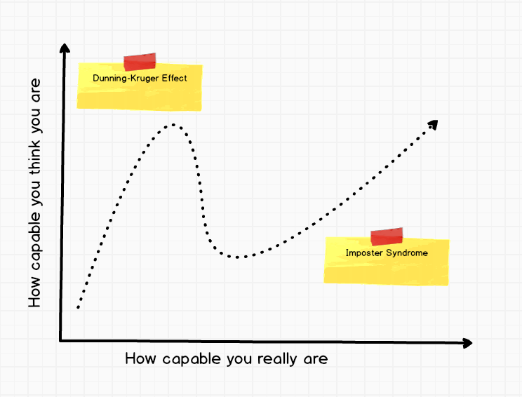
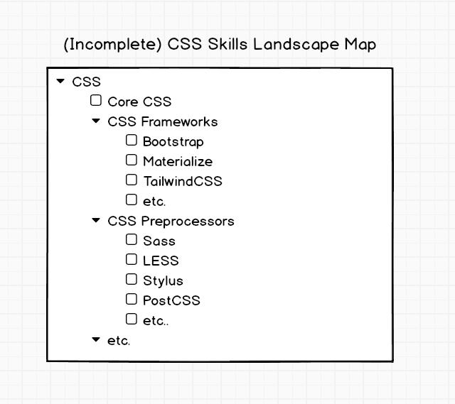

By now, we are all painfully aware of 2 concepts when it comes to skills:

The **Dunning-Kruger Effect**, which describes a situation where a person with a low
proficiency/capability in a subject doesn't even know enough to assess their own
capability. As a result, they assume that the little bit of knowledge they have
in the subject is the full extent of what there is to know. Consequently they
significantly overrate their ability.

**Imposter Syndrome**, which describes a situation where a person with high levels
of proficiency underestimates their own capability, primarily because their
in-depth knowledge of a specific subject has exposed them to many things that
they have not yet mastered.

The above are, of course, over-simplified definitions and each have been the
subject of many volumes. For the purposes of this article though, these
definitions suffice because they clearly highlight a key fact: **The
Dunning-Kruger effect and Imposter syndrome are two sides of the same coin.**

They're both a result of the relationship between:

* How much I actually know about a subject
* How much I am aware of how much there is to learn about a subject

Which means we can combat both sides of the coin if we can help people:

* Build a better understanding of the full map of skills they can learn
* Objectively assess their capability in a specific skill

This is, unfortunately, much easier said than done. I've been exploring this
topic for months now and am starting to feel that I've identified a thread on
which to pull. Here's my current (admittedly work-in progress) thinking:

It all depends on the level of granularity that we use when defining a skill.
For example, I know many developers who (when provided with a scale from 1-5,
where 1 is Absolute Beginner, and 5 is Master) would rate themselves as a 3 or a
4 on a skill like "Java". In their minds the thinking is:

*"I have been coding in Java for more than a year now and I'm confident in my abilities. Of course, I don't know everything, but that's why StackOverflow exists and that's why I'm not rating myself as a 5"*

But the reality is that "Java" is not actually even a skill, it is an entire
ecosystem of skills and it would be impossible to rate your skills in the entire
ecosystem. In fact, the self-reasoning provided above would be perfectly valid
for a seasoned Java tech lead as well, because the ecosystem is so large that
only a narcissist would consider themselves a master of it all. So how can one
then objectively differentiate between the different levels? The solution is to
break "Java" down into its composing sub-skills. For example: Java SE (the core
language), Java Build Tools, Jakarta EE, Spring, OSGi, etc.

At this lower level of detail, it becomes possible to assess your skills more
accurately. For example: If you've passed a Java OCP 2 exam, then you can
confidently rate your abilities in Java SE. But this is not the case for all of
the sub-skills though: **Spring, for example, is another Russian doll** that breaks
down into the Spring Framework, Spring MVC, Spring Security, Spring Data, etc.

So where do we draw the line?

Like all interesting questions, the answer to this one is: 

*"It depends."*

It depends on who the audience is, and what your goals are.

Since this article is focused on the technical learner, and their ability to
personally assess their capability in an objective way, the answer is to draw
the line at a level where a single topic can be learnt and mastered. We'll call
this an "Atomic Skill" for now. An "Atomic Skill" is typically something that
has:

* An industry working group and specification, and/or
* A Wikipedia page, and/or
* An NPM package, Maven Group, etc.

Let's pick CSS as an example here. Much like Java, CSS is an ecosystem itself
comprising the core language (which even has separate specifications), a large
variety of pre- and post- processors, and many associated build and automation
tools. As a first stab, I'd begin by breaking the CSS skills landscape into a
hierarchy like this:

Notice the number of "etceteras" in this hierarchy, and we're only talking about
the humble old CSS. Each of the leaf-nodes in this hierarchy represents an
"Atomic Skill".

Once we've identified an "Atomic Skill", we can then decompose it into the
concepts that comprise the skill itself. For example, the concepts that comprise
"Core CSS" may include (among many others):

* Rulesets
* Element Sizing
* Selectors
* Element Positioning
* Classes
* Floating Elements
* Comments
* Clearing Floats
* Web Safe Fonts
* Variables
* Font Properties
* Overriding Styles / Specificity
* Specifying Colours
* Responsive Images
* Box Model
* etc.

You can really think of this breakdown approach as looking at a tree with its branches
getting ever smaller. And like real trees, our tree doesn't live in isolation -
It lives in a forest.

If we had a breakdown of granular-level of concepts like this, which together
make up all the "things" a person could (theoretically) learn and master about a
skill, this could be used by an individual learner to objectively assess their
own proficiency in the "Atomic Skill". And it would also be useful to identify
new areas of study.

In theory, if you had access to such a comprehensive list, you could complete a
questionnaire in which you rate yourself in each of the concepts using the
following scale:

0. I don't know this word/concept at all.
1. I've read about this, but don't understand it fully and haven't really applied it.
2. I've used this, but it's a struggle with lots of Googling, copying and pasting.
3. I understanding this and use it comfortably. I might Google some details, but I generally know what I'm searching for.
4. I have a solid understanding of this concept and feel comfortable explaining it to other people.
5. I have in-depth knowledge of this concept and can comfortably discuss/debate details with other experts.

Based on how you rated the full set of underlying concepts, it would then be
possible to roll-up the numbers and provide an objective estimate of your
proficiency level for the "Atomic Skill".

Of course, you could still lie, but you would be lying to yourself - because,
remember, our goal is to provide a tool/process to an individual learner to
objectively assess their own skills.

There are further benefits of building such a comprehensive ontology of skills.
In particular, it would be possible to associate specific learning resources
like blog posts, online courses and industry documentation to the correct node
in the graph, therefore allowing a person to directly access learning material
that targets the specific concept where they may have a knowledge-gap.

I will explore some of these benefits in future posts.

For now, however, it should be clear that the availability of such a graph would
assist in addressing the underlying cause of both the Dunning-Kruger effect as
well as Imposter Syndrome.

We just need to build it, and that is precisely what DevSkillDojo is currently
doing. But it will have to be a community collaboration.

More on that in a follow-up article..

            