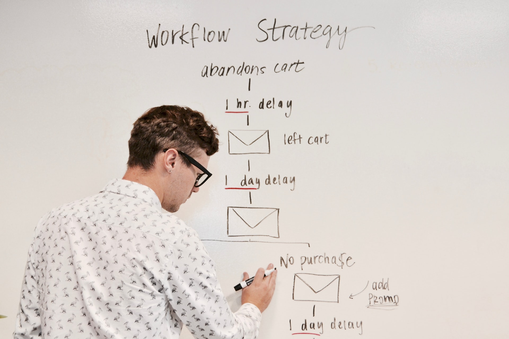
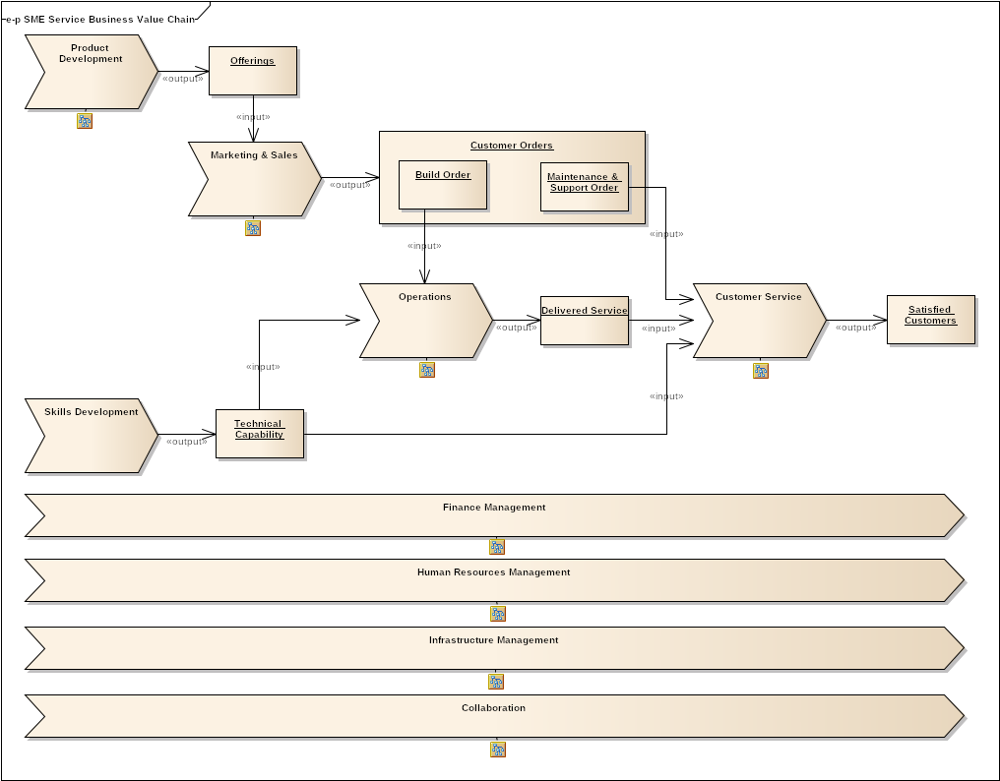
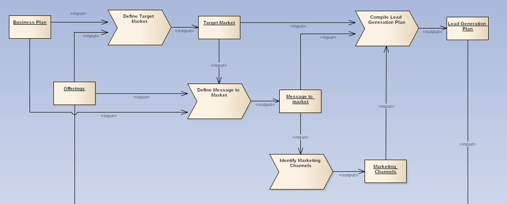

We often hear people speak about process "levels" using terms like "level 1", "level 2, or "level 5". 
This implies that that there is some globally agreed standard that specifies the levels of details in a business processes. 
This is, unfortunately, not the case.

What we do have, however, is a broad consensus that:

* **Process models can (and should) be arranged in hierarchies**. Where each lower "drill-down" provides details of HOW to do the activity that it links to
* **Top-level diagrams represent an "enterprise" or "contextual" view** which provides a general understanding of a process and its relationship to other processes.
* **Mid-level diagrams represent an "operational" view** which define more granular activities and identify all outcomes, including exceptions and alternative paths.
* **Low-level diagrams represent a "system" view** that can be used as a basis for simulation or execution.

To add some rigour to these loose definitions, I always use the [Zachman Framework](https://www.zachman.com/resources/ea-articles-reference/327-the-framework-for-enterprise-architecture-background-description-and-utility-by-john-a-zachman) for Enterprise Architecture. 
It provides 6 clearly defined levels of abstraction. 
These days, the levels of abstraction are titled "Reification Transformations" and they have new fancy names 
that sound very intimidating. 

Since I'm a simple guy, I'll stick to the terms from earlier versions of the framework. 

The levels are:
1. **Contextual level**, typically used to present process types to an audience comprising business executives.
2. **Conceptual level**, typically used to show how the inputs and outputs of different processes link together in a value chain. Generally the audience comprises business management.
3. **Logical level**, typically used to present the business logic inside processes, in particular event triggers, activity steps, decision steps and process participants. The audience for these models typically comprise subject matter experts in the business as well as architects and analysts. 
4. **Physical level**, typically a drill-down from the logical level which provides additional detail for the steps that have a significant systems component.
5. **Implementation level**, which generally comprises the platform-specific configuration code (or diagrams, in low/no-code tools)
6. **Product level**, which represents the running enterprise, i.e. the instantiation of the various models.

These levels work amazingly well for giving structure and rigour to a set of processes and activities. Generally I use them as follows:

## For the contextual level
At the contextual level I use a free-form Eriksson-Penker diagram to represent a Value Chain (of sorts). This value chain view
is intended to be a single-page representation of the entire enterprise. By necessity, this means that the diagram really contains 
functional business areas instead of processes.

Additionally, I have a few pre-baked examples of such value chains that I typically use as a starting point on many projects.
Here, for example, is a value chain for a service-based SME business (like ours):

It should be obvious that this model is inspired by Michael Porter's value chain concept (https://www.amazon.com/Competitive-Advantage-audiobook/dp/B07Q5JPLXL)

Each of the high-level functional areas would then be drilled-down into it's own conceptual-level model.

## For the conceptual level
At the conceptual level, I use a properly formatted Eriksson-Penker diagram (to be precise: a UML Diagram with Erikkson-Penker extensions).
The extensions were originally defined in the book by Hans-Erik Eriksson and Magnus Penker (https://www.amazon.com/Business-Modeling-UML-Patterns-Work/dp/0471295515).

Eriksson-Penker diagrams resemble old-school IDEF0 models, but is also similar to models from Jaques Hale's Value Analysis method (https://www.amazon.com/Concepts-Capabilities-Understanding-Exploiting-Competitive/dp/0471957984)

Irrespective of the specific notation you choose to employ, the idea is that a conceptual-level process model should not focus on step-by-step procedural logic,
but it should rather define the inputs and outputs of each process. When assembled together, the outputs from some processes become the inputs to other processes, 
effectively building a chain of value creation, that ultimately achieves the end-goal of the enterprise.

To keep conceptual models clean, I try to keep fewer that 10 (ideally less than 6) processes on a single diagram. 
This means that I sometimes create drill-down diagrams of sections that form a cohesive unit. These drill-down diagrams help to break down the model into manageable chunks, but they still belong in the conceptual layer of abraction.

As an example, here's an extract from a conceptual model for the Marketing & Sales functional area, based on ideas from the 1-Page Marketing Plan (https://www.amazon.com/The-1-Page-Marketing-Plan-audiobook/dp/B01KOQWSNQ)

## For the Logical Level
At the logical level I use BPMN2 notation, which contains all nitty-gritty details of the processes. This includes various aspects that 
help to define the business logic that forms part of the process. Details generally include:
* Events that trigger the process
* Human and automated activities that are performed
* Decision points that help define the route through the process
* Artefacts, like documents, that are used during the process.

One word of warning: BPMN really attempts to be everything for everyone, and could cause unnecessarily complex models if you're not careful. 
To address this concern, I always reference the workflow patterns defined by Prof van der Aalst and Prof ter Hofstede (http://www.workflowpatterns.com/)

And also, in a manner similar to the conceptual level, I sometimes create drill-down diagrams for sections that form a cohesive unit.

There is a gazillion examples of BPMN diagrams available online, this [Creately Article](https://creately.com/blog/examples/bpmn-templates-model-processes/) contains some good examples.

## For the Physical Level
At the physical level, I use UML Activity Diagrams. The intention here would be to model the detailed implementation logic that a developer would need
to understand while building the relevant component.

## For the Implementation level
The implementation level is alwasy platform-dependent. It may include source code (for a custom dev project), or perhaps a Domain-Specific-Language (like what is used in Robocorp), or perhaps some visual 
modelling approach(like what is used in many of the RPA tools).

## Conclusion

Just to reiterate: Within the conceptual and logical levels there are often drill-downs that stay inside the same level of abstraction. 
This is because the purpose of the drilldown is to group together logically related processes or activities. 

Remember: Each of the levels have a specific goal and audience. The mere existence of a drilldown does not imply we are going to a new "level". 

So that's my approach, I'd be keen to hear how others approach this.

