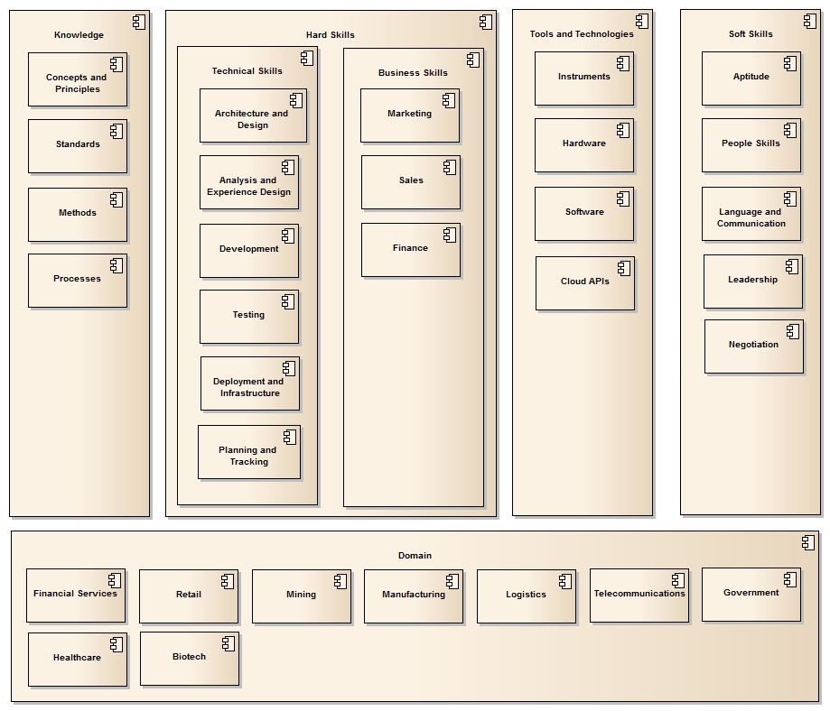

In the context of solution development, the word "Skill" is a difficult one.
Partly, because the field of solution development is so broad: It includes the
business side of running development projects, the creative side of design, the
technical aspects of architecture and engineering and even quality assurance.

But in my view the problem with the word "Skill" is that, depending on the
context, it is either extremely broad or extremely specific and technology
focused.

Let me support that statement with two examples: After doing a quick Google I
was able to find the following two items listed as skills on separate sites:

* Cloud Computing (From a LinkedIn article)
* Angular (From the DevSkiller catalogue)

Cloud Computing is a great example: A Linux Administrator who works
predominantly on AWS infrastructure will be perfectly within their rights to
claim that they are skilled in Cloud Computing. Similarly, a Java Developer who
builds applications targeted to Pivotal Cloud Foundry can also claim skills in
Cloud Computing. But these two people have VERY different skill sets. The point
is that "Cloud Computing" is really a broad industry category that is realised
by many different skills.

The second example is Angular. While being more granular and easier to measure,
this skill really refers to a specific technology, thereby ignoring the reality
that skills in any JavaScript framework have an assumed dependency on a set of
fundamental skills that will enable someone to cross between frameworks in a
reasonably short period of time. 

All of this was a long way to say that:

### 1. Skills have hierarchies, and
### 2. Skills are multi-faceted
### 3. Skills have deep networks of dependencies

 

To help us at DevSkillDojo apply the term "Skill" in a more rigorous fashion, we
have developed (and will continue to improve on) a framework of skills for
Solution Development.

Key Point 1: We are referring to **Solution** Development to make it absolutely
clear that the framework extends beyond just coding skills.

Key point 2: Solutions are delivered by people with **capabilities**. The dictionary
definition of “Capability” is roughly: The ability to do *something*. We like to
give a little bit of structure to the word, as follows:

**A CAPABILITY is generally:**

* The application of one or more HARD SKILLS,
* Guided by pre-existing underlying KNOWLEDGE
* Using one or more TOOLS or TECHNOLOGIES
* By a person with a set of SOFT SKILLS

The diagram below provides an overview of the first version of the framework
that can be shared to a wider audience:

Note: The latest version of the framework is available at: https://devskilldojo.com/skills-framework/overview

Using this framework we are now able to classify all skills into a suitable 
category, each of which fits into a skills perspective. In addition to the
framework itself, we are preparing a skills domain model as well as an ontology
of skills. These will be made available when they become ready for distribution.

If you'd like to stay in touch with our progression on this journey of
exploration, follow this blog (http://devskilldojo.com) or our twitter feed(@devskilldojo). 
And if you have any feedback on the framework, please drop us a note on Twitter.
           