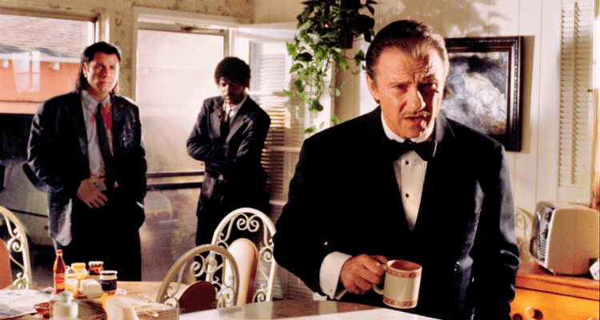
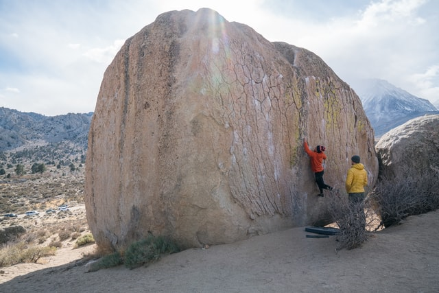
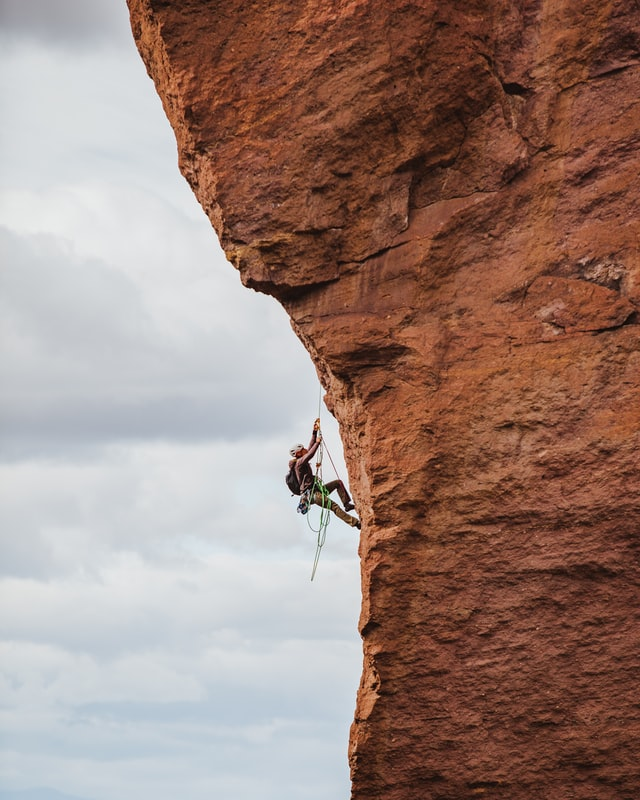
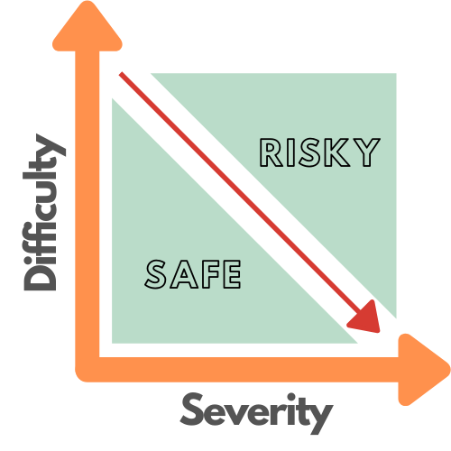

A frequent aspect of my professional career has been to serve as a "fixer". The fixer is similar to Mr Wolf from 
Pulp Fiction - he only gets called when things really got off the rails. 
In those situations there tends to be a lot of emotion involved. 
People start blaming each other, impulse- and ego-driven decisions get made, and the situation gets worse. 

In short: You have a problem that's bad, but aggravating circumstances turn it into a disaster. 

The fixer's role is to bring calm to the situation, identify the severity and make a practical plan for resolving it. 
In my role as a fixer, I often reference two specific analogies when assessing the best course of action, 
and this morning I thought it might be a good time to share them publicly. 

So here goes: 

## Analogy 1: From rock climbing

Quick disclaimer, just in case there is any misunderstanding: I suck quite badly at rock climbing, but I own some gear.

Anyhoo, in the world of rock climbing, the routes that get climbed are often rated from 2 different perspectives. 
The first perspective is the **difficulty rating**, i.e. how difficult is it to execute the moves needed to reach the top of the route. 

The second perspective is called **exposure** and it (roughly) measures how dangerous the route is. 
In other words, if you happen to fall, how severe would the consequences be. 

By combining these two factors, you get a more balanced view of the risk of the route. 

For example, one sub-discipline of rock climbing is called "Bouldering", in which the participants climb insanely difficult routes. 
But bouldering routes are only a few metres high, so even if you fall (which is very likely) you just land on a mattress 
that you placed on the ground. And then you try again, until you succeed. 

So in bouldering the likelyhood of falling is very high, but the consequences of falling are small, 
perhaps a sprained ankle, as a worst case. 

However, if you're climbing a big wall in the high Drakensberg (or Yosemite, for that matter), 
the consequences of falling are much more severe. 

To balance out the risk, a reasonable climber would only attempt easier routes (for their own skill level) 
to ensure that the likelyhood of falling is reduced. 
And, of course, you take some harnesses and rope, just to be sure :) 

In short: The risk of a route consists of two separate components, which should be played against each other for optimum results.
We'll call this concept the **"Weighted-Risk"**, depicted using the difficulty-severity-curve below. 

I'll come back to it after a round of golf. 

## Analogy 2: From golf

Much like rock climbing, I suck quite badly at golf (I know, there's a pattern emerging). 

In my golfing days I spent A LOT of time in the rough. In the process I learnt many lessons. 

Most importantly that golf is not for me. These days I enjoy hiking in the woods, which is very similar to my experience with golf - 
Still a heavy bag to carry and the grass is still thick, but at least I'm not searching for a little white ball. 

I also learnt that when you've hit the left-hand rough from your tee shot, on hole 3 of a golf course that 
you've been wanting to play for 2 years, stuck behind a tree, you have two options: 

#### Option 1
Option 1 is to try to hit a perfect shot. You can visualise it easily: 
The club connects cleanly with the ball, despite the problematic lie. As the ball leaves the dense grass, 
it draws effortlessly around the branches of the majestic oak tree that is obscuring your view of the pin. 
It lands right next to the green, perfectly positioned for an up-and-down par 4. 
And with a bit of luck, you might even chip in for birdie. 

If you choose option 1, and execute it successfully, there would be no harm done. 
It would almost be as if you never missed the fairway in the first place. 

There's just one catch: The shot required is **insanely difficult**. If this was a driving range, where you could attempt the 
shot over-and-over without any consequences, it would be SO COOL when you finally get it right. 

However, on hole number 3 of a bucket-list golf-course, with just one attempt available, the implications of failure are more severe. 

If you don't connect properly with the ball, it'll probably fly just a few metres closer to the oak tree, 
from where a recovery shot would be EVEN MORE difficult. 

Or, on the odd chance that you lift it out of the rough successfully, you might fail to add the required draw, causing the ball to 
fly over the fairway into the river on the other side. 

And even if you do manage to add a draw to the ball, it might still hit one of the branches of the oak tree towering right in front of you. 

In most of those scenarios it totally ruins hole number 3 for you, ensuring a lost temper, likely to ruin holes 4 through 18. 

Luckily there's whiskey at the 19'th! 

But you also have Option 2. 

#### Option 2
Option 2 is less glamorous, requiring a safe chip shot angled back towards the fairway. 
From there you'll still need a long iron to reach the green and if you don't make another unforced error, you'll drop 1 shot. 
Still well-positioned to enjoy the rest of the day. 

## Applying our sporting lessons

Like in golf, slip-ups are inevitable in software projects, even under the best possible circumstances. This is just a reality of life. 

If you look at the stats (For reference, see https://www.pgatour.com/content/pgatour/stats/stat.213.y2021.html), 
PGA players miss the fairway from their tee shot 40% of the time. 

Let's break that down:
 - The **best players** in the world, 
 - Using the **best gear**, 
 - Supported by the **best staff**, 
 - With the **best training**, 
 - On the **best golf courses**,
 - With a ball in the **best position** (perfectly balanced on a tee)
 - **Still** slip up 40% of the time.

It seems clear that the key to successful golf is not to hit the fairway a 100% of the time. 
Of course, that would be awesome, but it is also impossible. The key is to:
- Understand that you will miss the fairway from time to time
- If you do hit the rough, assess the **weighted-risk** of the situation by objectively reviewing the difficulty of the shot and the severity of a further mistake.
- Make your next move accordingly (And without emotion)

These lessons can be directly applied to software projects. We need to understand that slip ups do happen. 
**ALL. THE. TIME.** 
The skill we need to learn is how to handle such slip ups. 
We must be honest with ourselves about the situation, understand the options at our disposal, 
and assess the options using a **weighted-risk framework**.

And we need to acknowledge that sometimes, when you're in the deep rough, stuck behind a massive oak tree, 
the best idea is to chip back to the fairway. 
You might drop one or two shots on this hole, but golf is an 18 hole game.

